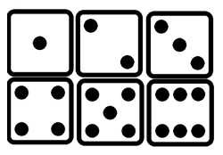
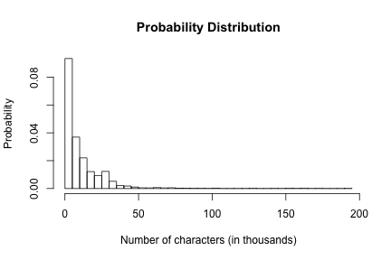
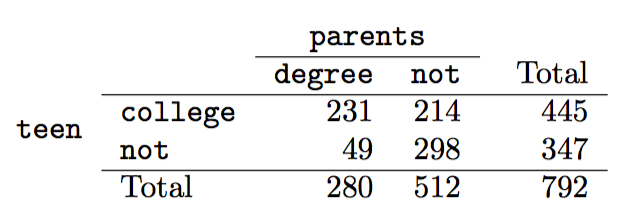
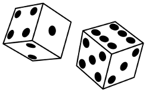
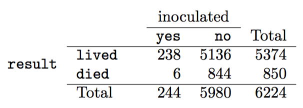

## Course Logistic

* Every Wednesday 19:00 - 21:00
* Slides: http://nikolaypavlov.github.io/da-workshops-3/
* Skype Chat: https://join.skype.com/gjN0CfAd4bhg
* Reference Book: https://www.openintro.org/stat/textbook.php
* [Conditional Probability](http://setosa.io/ev/conditional-probability/)
* Install the following packages: openintro

---
## Topics

* Classical probability
* Properties
* Probability distribution (Special topic)
* Conditional probability
* Independent events
* Law of total probability
* Bayes's theorem

---
## Classical probability

Let's say we have a set of events $\{w_1, \dotsc, w_n\}$



1. Set of events is collectively exhaustive
2. All events are mutualy exclusive
3. All events are equialy possible

Probability of elementary event: $P(w_i) = \frac{1}{n}$

Probability of event: $P(A) = \frac{k}{n}$

---
## Classical probability properties

Sample space $\Omega = \{w_1, \dotsc, w_n\}$

* $P(\Omega) = 1$ 
* $P(A) = 0 <=> A = \emptyset$
* $P(A \sqcup B) = P(A) + P(B)$ - disjoint outcomes
* $P(A \cup B) = P(A) + P(B) - P(A \cap B)$ - general addition rule

--- 
## Exercise. Part 1


```r
addmargins(table(email$spam, email$number, dnn=c("Spam", "Number")))
```

```
##      Number
## Spam  none small  big  Sum
##   0    400  2659  495 3554
##   1    149   168   50  367
##   Sum  549  2827  545 3921
```

Of the 3,921 emails, 549 had no numbers, 2,827 had only one or more small numbers, and 545 had at least one big number.

1. Are the outcomes none, small, and big disjoint?
2. Determine the proportion of emails with value small and big separately.
3. Compute the probability a randomly selected email from the data set has a number in it, small or big.


---
## Exercise. Part 2


```r
addmargins(table(email$spam, email$number, dnn=c("Spam", "Number")))
```

```
##      Number
## Spam  none small  big  Sum
##   0    400  2659  495 3554
##   1    149   168   50  367
##   Sum  549  2827  545 3921
```

In the email data set with 3,921 emails, 367 were spam, 2,827 contained some small numbers but no big numbers, and 168 had both characteristics.

4. Determine the probability a randomly drawn email from the email data set is spam and had small numbers (but not big numbers).
5. What is the probability that the email had either of these attributes?


---
## Classical probability properties

* $P(A_1 \cup \dotsc \cup A_k) = P(A_1) + \dotsc + P(A_k) - P(A_1 \cap A_2) - P(A_1 \cap A_3) - \dotsc - \\ - P(A_{k-1} \cap A_k) + \dotsc + (-1)^{k-1} P(A_1 \cap \dotsc \cap A_k)$

* $P(A_1 \cup \dotsc \cup A_k) \leq P(A_1) + \dotsc + P(A_k)$

* $\bar{A} := \Omega \backslash A, P(\bar{A}) = 1 - P(A)$

---
## Probability distribution (special topic)


```r
hist(email$num_char, seq(0, 195.0, by=5), probability=T, xlab="Number of characters (in thousands)", 
     ylab="Probability", main="Probability Distribution")
```



1. The outcomes listed must be disjoint.
2. Each probability must be between 0 and 1. 
3. The probabilities must total 1.

---
## Conditional probability

Let's say we roll a die once. Event A is 1. Event B is even outcome. 


1. Find $P(A|B)$
2. Find $P(A|B)$, if A is 2.

In general $\Omega = \{w_1, \dotsc, w_n\}, B = \{w_1, \dotsc, w_k\}, k \geq 1$, 

then $P(A|B) = \frac{|A \cap B|}{|B|} = \frac{|A \cap B| \frac{1}{\Omega}}{|B| \frac{1}{\Omega}} = \frac{P(A \cap B)}{P(B)}$, $P(B) \ne 0$

$P(A|B) P(B) = P(A \cap B)$ - general multiplication rule

---
## Example



* If at least one parent of a teenager completed a college degree, what is the chance the teenager attended college right after high school?

$P(A|B) = \frac{|A \cap B|}{|B|} = 231/280 = 0.825$ 

* A teenager is randomly selected from the sample and she did not attend college right after high school. What is the probability that at least one of her parents has a college degree?

$P(A|B) = \frac{|A \cap B|}{|B|} = 49/347 = 0.141$ 

---
## Independent events

Let's say we have some events $A, B$ in the sample space $\Omega$. $A$ independent of $B$, if 

$P(A|B) = P(A)$, $B \ne \emptyset$, same for $P(B|A) = P(B)$, $A \ne \emptyset$

$P(A|B) P(B) = P(A) P(B) \Leftrightarrow P(A \cap B) = P(A) P(B)$

$P(A \cap B)$ - joint probability
$P(A), P(B)$ - marginal probability

---
## Example

About 9% of people are left-handed. Suppose 2 people are selected at random from the population. Because the sample size of 2 is very small relative to the population, it is reasonable to assume these two people are independent.

* What is the probability that both are left-handed?
* What is the probability that both are right-handed?

$P(A \cap B) = P(A) P(B) = 0.09 * 0.09 = 0.0081$
$P(\bar{A} \cap \bar{B}) = (1 - P(A)) * (1 - P(B)) = 0.91 * 0.91  = 0.8281$

---
## Exercise. Part 1.

Let X and Y represent the outcomes of rolling two dice.



1. What is the probability that the first die, X, is 1?
2. What is the probability that both X and Y are 1?
3. Use the formula for conditional probability to compute P (Y = 1 | X = 1)
4. What is P (Y = 1)? Is this different from the answer from part 3?

Hint: think about the relationships between X and Y

---
## Smallpox in Boston 1721



* Find the probability that a randomly selected person who was not inoculated died from smallpox.
* Determine the probability that an inoculated person died from smallpox.


---
## Law of total probability

Let's say we have some event $A$ in the sample space $\Omega$, and mutualy exclusive $B_1, \dotsc, B_k$, so that $B_1 \sqcup \dotsc \sqcup B_k = \Omega$ 

$P(A) = P(A \cap B_1) + \dotsc + P(A \cap B_k) = P(A|B_1) P(B_1) + \dotsc + P(A|B_k) P(B_k)$ 

$P(A) = \sum_{i=1}^{k}P(A|B_i) P(B_i)$ 

### Example

Suppose that two factories supply light bulbs to the market. Factory X's bulbs work for over 5000 hours in 99% of cases, whereas factory Y's bulbs work for over 5000 hours in 95% of cases. It is known that factory X supplies 60% of the total bulbs available. What is the chance that a purchased bulb will work for longer than 5000 hours?

$P(A) = P(A|B_X) P(B_X) + P(A|B_Y) P(B_Y) = 0.99 * 0.6 + 0.95 * 0.4 = 0.974$

---
## Bayes' theorem

We know that $P(A) = \sum_{i=1}^{k}P(A|B_i) P(B_i)$, but if we want to know $P(B_i|A)$? 

$P(A \cap B_i) = P(A|B_i) P(B_i) = P(B_i \cap A) = P(B_i|A) P(A)$

$P(B_i|A) = \frac{P(A|B_i) P(B_i)}{P(A)} = \frac{P(A|B_i) P(B_i)}{\sum_{i=1}^{k}P(A|B_i) P(B_i)}$

--- 
## Example

Sasha is a system administrator of popular movie file server. Sometimes, when new movie comes out, his server uplink is overloaded. 35% of new movies are commedies, 20% sci-fi, and 45% are horrors. When new commedie comes out, the server uplink fills up about 25% of times, it fills up 70% of times with a release of the new sci-fi, and 5% of time in case of new horror movie. 

If Sasha comes to work and finds the uplink is overloaded, what is the probability that new sci-fi movie is on the server?

$A$ - full uplink event, $B_1, B_2, B_3$ - new commedie, sci-fi, horror events, $P(B_2|A)$ - ?

$P(B_1) = 0.35, P(B_2) = 0.2, P(B_3) = 0.45$

$P(A|B_1) = 0.25, P(A|B_2) = 0.7, P(A|B_3) = 0.05$

$P(B_2|A) = \frac{P(A|B_2) P(B_2)}{P(A|B_1) P(B_1) + P(A|B_2) P(B_2) + P(A|B_3) P(B_3)}$

$P(B_2|A) = \frac{0.7 * 0.2}{0.25 * 0.35 + 0.7 * 0.2 + 0.05 * 0.45} = 0.56$

---
## Homework

* [Lab 2 - Probability](http://htmlpreview.github.io/?https://github.com/andrewpbray/oiLabs-base-R/blob/master/probability/probability.html)
* Skype Chat for discussions: https://join.skype.com/gjN0CfAd4bhg
* Reading: OpenIntro Statistics Chapter 2, till p. 2.3
* Reference Book: https://www.openintro.org/stat/textbook.php
* [Conditional Probability](http://setosa.io/ev/conditional-probability/)
